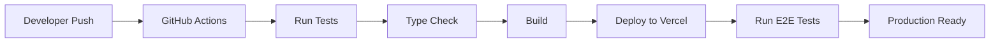

# High Level Design Document

**Project:** D&D Encounter Tracker Web App  
**Version:** 1.0  
**Date:** June 8, 2025  
**Framework:** Next.js 15 + MongoDB

## 1. Executive Summary

This document outlines the technical implementation approach for the D&D Encounter Tracker, a freemium SaaS application built with Next.js 15 and MongoDB. The system will support initiative tracking, combat management, legendary actions, lair actions, and subscription-based feature gating.

## 2. System Architecture Overview

### 2.1 High-Level Architecture

```text
┌─────────────────────────────────────────────────────────────┐
│                    Vercel Edge Network                      │
│  ┌─────────────────┐  ┌─────────────────┐  ┌─────────────┐ │
│  │   Static Assets │  │  Next.js App    │  │  API Routes │ │
│  │   (Images, CSS) │  │  (SSR/SSG)      │  │  (Server)   │ │
│  └─────────────────┘  └─────────────────┘  └─────────────┘ │
└─────────────────────────────────────────────────────────────┘
                              │
                              ▼
┌─────────────────────────────────────────────────────────────┐
│                     External Services                      │
│  ┌─────────────┐  ┌─────────────┐  ┌─────────────┐        │
│  │  MongoDB    │  │   Stripe    │  │   Vercel    │        │
│  │   Atlas     │  │  Payments   │  │    Blob     │        │
│  └─────────────┘  └─────────────┘  └─────────────┘        │
└─────────────────────────────────────────────────────────────┘
```

### 2.2 Core Components

- **Frontend**: Next.js 15 App Router with React Server/Client Components
- **Backend**: Next.js API Routes with Edge Runtime optimization
- **Database**: MongoDB Atlas with Mongoose ODM
- **Authentication**: NextAuth.js v5 with MongoDB session storage
- **Payments**: Stripe with webhooks for subscription management
- **Hosting**: Vercel with automatic deployments

## 3. Database Design

### 3.1 Core Collections

#### Users Collection

```typescript
interface User {
  _id: ObjectId;
  email: string;
  name: string;
  subscriptionTier: 'free' | 'seasoned' | 'expert' | 'master' | 'guild';
  subscriptionId?: string; // Stripe subscription ID
  limits: {
    parties: number;
    encounters: number;
    creatures: number;
    maxParticipants: number;
  };
  createdAt: Date;
  updatedAt: Date;
}
```

#### Parties Collection

```typescript
interface Party {
  _id: ObjectId;
  userId: ObjectId;
  name: string;
  description?: string;
  characters: Character[];
  createdAt: Date;
  updatedAt: Date;
}

interface Character {
  id: string;
  name: string;
  playerName?: string;
  race: string;
  classes: string[];
  level: number;
  dexterity: number;
  armorClass: number;
  maxHitPoints: number;
  currentHitPoints: number;
  initiativeModifier: number;
}
```

#### Encounters Collection

```typescript
interface Encounter {
  _id: ObjectId;
  userId: ObjectId;
  name: string;
  description?: string;
  creatures: Creature[];
  lairActions: LairAction[];
  status: 'planning' | 'active' | 'completed';
  currentRound: number;
  currentTurn: number;
  initiativeOrder: InitiativeEntry[];
  createdAt: Date;
  updatedAt: Date;
}

interface Creature {
  id: string;
  name: string;
  type: 'pc' | 'npc' | 'monster';
  armorClass: number;
  dexterity: number;
  maxHitPoints: number;
  currentHitPoints: number;
  initiativeModifier: number;
  legendaryActions?: LegendaryAction[];
  statusEffects: StatusEffect[];
}

interface LairAction {
  id: string;
  name: string;
  description: string;
  trigger: 'initiative_20' | 'custom';
  isActive: boolean;
}
```

#### Combat Logs Collection (Premium Feature)

```typescript
interface CombatLog {
  _id: ObjectId;
  userId: ObjectId;
  encounterId: ObjectId;
  actions: LogEntry[];
  createdAt: Date;
}

interface LogEntry {
  timestamp: Date;
  round: number;
  turn: number;
  action: string;
  details: Record<string, any>;
}
```

### 3.2 Database Indexes

```javascript
// Users
db.users.createIndex({ email: 1 }, { unique: true });
db.users.createIndex({ subscriptionId: 1 });

// Parties
db.parties.createIndex({ userId: 1 });
db.parties.createIndex({ userId: 1, createdAt: -1 });

// Encounters
db.encounters.createIndex({ userId: 1 });
db.encounters.createIndex({ userId: 1, status: 1 });
db.encounters.createIndex({ userId: 1, createdAt: -1 });

// Combat Logs
db.combatlogs.createIndex({ userId: 1, encounterId: 1 });
db.combatlogs.createIndex({ createdAt: 1 }, { expireAfterSeconds: 31536000 }); // 1 year TTL
```

## 4. API Design

### 4.1 API Route Structure

```text
/api/
├── auth/
│   ├── [...nextauth]/route.ts          # NextAuth.js configuration
│   └── profile/route.ts                # User profile management
├── users/
│   ├── limits/route.ts                 # Check usage limits
│   └── subscription/route.ts           # Subscription management
├── parties/
│   ├── route.ts                        # CRUD operations
│   ├── [id]/route.ts                   # Individual party operations
│   └── [id]/characters/route.ts        # Character management
├── encounters/
│   ├── route.ts                        # CRUD operations
│   ├── [id]/route.ts                   # Individual encounter operations
│   ├── [id]/initiative/route.ts        # Initiative management
│   ├── [id]/combat/route.ts            # Combat actions
│   └── [id]/lair-actions/route.ts      # Lair action management
├── creatures/
│   ├── library/route.ts                # Creature library/templates
│   └── [id]/route.ts                   # Individual creature operations
├── webhooks/
│   └── stripe/route.ts                 # Stripe webhook handler
└── utils/
    ├── export/route.ts                 # Data export functionality
    └── import/route.ts                 # Data import functionality
```

### 4.2 Core API Endpoints

#### Authentication & Users

```typescript
// GET /api/auth/profile
// POST /api/auth/profile
// GET /api/users/limits
// POST /api/users/subscription
```

#### Parties Management

```typescript
// GET /api/parties - List user's parties
// POST /api/parties - Create new party
// GET /api/parties/[id] - Get party details
// PUT /api/parties/[id] - Update party
// DELETE /api/parties/[id] - Delete party
// POST /api/parties/[id]/characters - Add character
// PUT /api/parties/[id]/characters/[charId] - Update character
// DELETE /api/parties/[id]/characters/[charId] - Remove character
```

#### Encounter Management

```typescript
// GET /api/encounters - List user's encounters
// POST /api/encounters - Create new encounter
// GET /api/encounters/[id] - Get encounter details
// PUT /api/encounters/[id] - Update encounter
// DELETE /api/encounters/[id] - Delete encounter
// POST /api/encounters/[id]/initiative - Roll/set initiative
// PUT /api/encounters/[id]/initiative - Update initiative order
// POST /api/encounters/[id]/combat - Perform combat action
// GET /api/encounters/[id]/lair-actions - Get lair actions
// POST /api/encounters/[id]/lair-actions - Trigger lair action
```

## 5. Frontend Architecture

### 5.1 App Router Structure

```text
app/
├── (auth)/
│   ├── login/page.tsx
│   ├── register/page.tsx
│   └── layout.tsx
├── (dashboard)/
│   ├── dashboard/page.tsx
│   ├── parties/
│   │   ├── page.tsx                    # Parties list
│   │   ├── [id]/page.tsx              # Party details
│   │   └── create/page.tsx            # Create party
│   ├── encounters/
│   │   ├── page.tsx                    # Encounters list
│   │   ├── [id]/page.tsx              # Encounter tracker
│   │   └── create/page.tsx            # Create encounter
│   ├── creatures/
│   │   ├── page.tsx                    # Creature library
│   │   └── create/page.tsx            # Create creature
│   ├── subscription/page.tsx          # Subscription management
│   └── layout.tsx                     # Dashboard layout
├── api/                               # API routes (see section 4.1)
├── globals.css
├── layout.tsx                         # Root layout
└── page.tsx                           # Landing page
```

### 5.2 Component Architecture

#### Shared Components

```typescript
// components/ui/ (shadcn/ui components)
// components/forms/
// components/combat/
// components/subscription/
// components/layout/
```

#### Core Combat Components

```typescript
// components/combat/
├── InitiativeTracker.tsx              # Main initiative display
├── TurnManager.tsx                    # Turn controls
├── CreatureCard.tsx                   # Individual creature display
├── HPTracker.tsx                      # HP management
├── StatusEffectManager.tsx            # Conditions/effects
├── LegendaryActionTracker.tsx         # Legendary actions
├── LairActionManager.tsx              # Lair actions
└── CombatLog.tsx                      # Action history (premium)
```

### 5.3 State Management

#### Global State (Zustand)

```typescript
interface AppState {
  user: User | null;
  subscription: SubscriptionData | null;
  currentEncounter: Encounter | null;
  combatState: CombatState | null;
}

interface CombatState {
  currentRound: number;
  currentTurn: number;
  initiativeOrder: InitiativeEntry[];
  isActive: boolean;
}
```

#### Server State (TanStack Query)

```typescript
// queries/
├── useUsers.ts
├── useParties.ts
├── useEncounters.ts
├── useCreatures.ts
└── useSubscription.ts
```

## 6. Implementation Phases

### 6.1 Phase 1: Foundation & MVP (Months 1-3)

#### Sprint 1: Project Setup & Authentication

- [ ] Initialize Next.js 15 project with TypeScript
- [ ] Configure Tailwind CSS and shadcn/ui
- [ ] Set up MongoDB Atlas and Mongoose schemas
- [ ] Implement NextAuth.js with MongoDB adapter
- [ ] Create basic user registration/login flows
- [ ] Set up Vercel deployment pipeline

#### Sprint 2: Core Data Models & Basic UI

- [ ] Implement User, Party, and Character schemas
- [ ] Create party management pages (CRUD)
- [ ] Build character creation/editing forms
- [ ] Implement basic party listing and details views
- [ ] Add form validation with Zod
- [ ] Create responsive navigation layout

#### Sprint 3: Encounter Foundation

- [ ] Implement Encounter and Creature schemas
- [ ] Create encounter management pages (CRUD)
- [ ] Build creature creation/editing forms
- [ ] Implement basic initiative rolling system
- [ ] Create encounter listing and details views
- [ ] Add encounter status management

#### Sprint 4: Combat Tracker MVP

- [ ] Build initiative tracker component
- [ ] Implement turn management system
- [ ] Create HP tracking functionality
- [ ] Add basic status effect management
- [ ] Implement round progression
- [ ] Create mobile-responsive combat interface

### 6.2 Phase 2: Advanced Combat & Monetization (Months 4-6)

#### Sprint 5: Legendary & Lair Actions

- [ ] Implement legendary action management
- [ ] Build lair action system with initiative count 20 triggers
- [ ] Create action counter tracking
- [ ] Add visual indicators for special actions
- [ ] Implement action description management
- [ ] Test combat flow integration

#### Sprint 6: Subscription System

- [ ] Set up Stripe integration and webhooks
- [ ] Implement subscription tier logic
- [ ] Create usage limit enforcement
- [ ] Build subscription management UI
- [ ] Add billing dashboard
- [ ] Implement trial system

#### Sprint 7: Premium Features

- [ ] Build advanced combat logging system
- [ ] Implement data export functionality (PDF, JSON)
- [ ] Create usage analytics dashboard
- [ ] Add cloud sync for paid users
- [ ] Implement automated backup system
- [ ] Build upgrade prompts and limit notifications

#### Sprint 8: Polish & Optimization

- [ ] Implement comprehensive error handling
- [ ] Add loading states and skeleton UI
- [ ] Optimize database queries and indexes
- [ ] Add comprehensive testing suite
- [ ] Implement SEO optimization
- [ ] Performance testing and optimization

### 6.3 Phase 3: Growth Features (Months 7-9)

#### Sprint 9: Collaboration Features

- [ ] Implement encounter sharing system
- [ ] Build collaborative editing features
- [ ] Add real-time updates with Pusher/Socket.IO
- [ ] Create permission management system
- [ ] Implement comment/note system
- [ ] Add activity feeds

#### Sprint 10: Advanced Analytics

- [ ] Build comprehensive analytics dashboard
- [ ] Implement play style analytics
- [ ] Create encounter difficulty analysis
- [ ] Add usage pattern insights
- [ ] Build performance metrics tracking
- [ ] Implement A/B testing framework

#### Sprint 11: Mobile Optimization

- [ ] Optimize mobile interface design
- [ ] Implement touch-friendly interactions
- [ ] Add offline capability with service workers
- [ ] Create progressive web app features
- [ ] Optimize for tablet usage
- [ ] Add mobile-specific shortcuts

#### Sprint 12: Third-Party Integrations

- [ ] Research and plan D&D Beyond integration
- [ ] Implement Roll20 data import/export
- [ ] Build API for external tool integration
- [ ] Create webhook system for external tools
- [ ] Add Discord bot integration
- [ ] Implement social sharing features

## 7. Security Considerations

### 7.1 Authentication & Authorization

- NextAuth.js v5 with secure session management
- Role-based access control (RBAC) middleware
- JWT tokens with automatic rotation
- Secure cookie configuration
- Rate limiting on authentication endpoints

### 7.2 Data Protection

- Input validation with Zod schemas
- SQL injection prevention (NoSQL injection for MongoDB)
- XSS protection with Content Security Policy
- CSRF protection with NextAuth.js
- Secure headers configuration

### 7.3 Payment Security

- PCI DSS compliance through Stripe
- Webhook signature verification
- Secure API key management
- Subscription data validation
- Secure customer data handling

## 8. Performance & Scalability

### 8.1 Frontend Optimization

- Next.js App Router with Server Components
- Static generation for public pages
- Image optimization with next/image
- Code splitting and lazy loading
- Efficient bundle optimization

### 8.2 Backend Optimization

- MongoDB indexing strategy
- Query optimization with aggregation pipelines
- Edge Runtime for API routes
- Efficient data pagination
- Caching strategy with Next.js

### 8.3 Monitoring & Observability

- Sentry for error tracking and performance monitoring
- Vercel Analytics for user behavior insights
- Custom logging with structured JSON
- Performance metrics tracking
- Database performance monitoring

## 9. Testing Strategy

### 9.1 Testing Pyramid

```text
┌─────────────────────────────────┐
│         E2E Tests               │  ← Playwright (Critical paths)
│       (5% of tests)             │
├─────────────────────────────────┤
│      Integration Tests          │  ← API routes, DB integration
│       (15% of tests)            │
├─────────────────────────────────┤
│        Unit Tests               │  ← Components, utilities
│       (80% of tests)            │
└─────────────────────────────────┘
```

### 9.2 Testing Tools & Strategy

- **Unit Tests**: Jest + React Testing Library for components
- **Integration Tests**: Jest for API routes and database operations
- **E2E Tests**: Playwright for critical user journeys
- **Component Tests**: Storybook for UI component development
- **Performance Tests**: Lighthouse CI for web vitals

## 10. Deployment & DevOps

### 10.1 Deployment Pipeline



### 10.2 Environment Management

- **Development**: Local development with MongoDB local instance
- **Preview**: Vercel preview deployments for each PR
- **Staging**: Dedicated staging environment with production-like data
- **Production**: Vercel production with MongoDB Atlas

## 11. Risk Mitigation

### 11.1 Technical Risks

- **Database Performance**: Implement proper indexing and query optimization
- **Payment Processing**: Use Stripe's robust webhook system with retry logic
- **Real-time Features**: Implement graceful degradation for collaboration features
- **Mobile Performance**: Progressive enhancement approach

### 11.2 Business Risks

- **Feature Creep**: Strict adherence to MVP scope and phased development
- **User Adoption**: Comprehensive onboarding and trial experience
- **Competition**: Focus on unique features (lair actions, D&D-specific optimization)
- **Scalability**: Design for growth from day one with cloud-native architecture

## 12. Success Metrics & KPIs

### 12.1 Technical Metrics

- **Performance**: Core Web Vitals scores > 90
- **Uptime**: 99.9% availability SLA
- **Error Rate**: < 0.1% of requests result in errors
- **Load Time**: < 3 seconds initial page load

### 12.2 Business Metrics

- **User Engagement**: > 4 sessions per month for active users
- **Conversion Rate**: > 5% free-to-paid conversion within 30 days
- **Feature Adoption**: > 70% of premium users use advanced features
- **Churn Rate**: < 5% monthly churn for paid subscribers

## 13. Conclusion

This high-level design provides a comprehensive roadmap for building the D&D Encounter Tracker as a modern, scalable SaaS application. The phased approach ensures steady progress while maintaining focus on core user value. The technology stack leverages industry best practices with Next.js 15 and MongoDB to deliver a performant, secure, and maintainable solution.

The design emphasizes:

- **User-Centric Development**: Features directly address DM pain points
- **Technical Excellence**: Modern stack with best practices
- **Business Viability**: Clear monetization strategy with freemium model
- **Scalability**: Architecture designed to grow with user base
- **Quality Assurance**: Comprehensive testing and monitoring strategy

Implementation should begin with Phase 1 MVP features, establishing a solid foundation before adding advanced features and monetization in subsequent phases.
